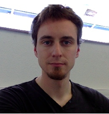

[comment]: 

Hi, I'm Corentin Lapeyre. Born in Toulouse France, brought up there and in
Berkeley, CA, I have always been passionate about physics. I completed a
scientific baccalaureate, and went to engineering school where I was able to
participate in a [student race car project](http://www.epsa-team.com/). This
confirmed my taste for technological challenges, from computer-aided design and
optimisation to production and quality control.  I then decided to turn to
aerospace engineering, and completed my masters in this field.  After 6 months
at Purdue, I found an opportunity for a Ph.D. in numerical combustion physics
in France, and I decided to go back.  I successfully defended my Ph.D. in
September of 2015, and I am continuing to study combustion physics as a
postdoctoral fellow.

During the course of my studies, I have extensively used and learned about
computer-aided design, as well as low and high level coding.  I have worked
with Fortran/MPI for High Performance Computing applications, and with Python
extensively for scientific computing.  I am a daily user of git, vim and LaTeX.
I strongly believe that the scientific world is often too far from modern
programming tools, and would greatly benefit from it.
